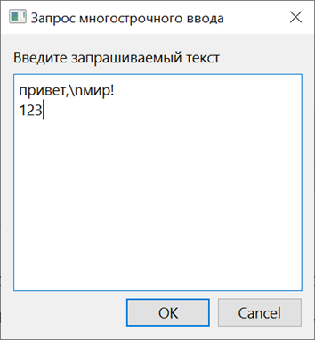

# Depyter

Размер репозитория: <5 МБайт.

## Установка библиотек

```commandline
pip install -r requirements.txt
```

В Linux Debian также может потребоваться установка дополнительных пакетов:

```commandline
sudo apt install libxkbcommon-x11-0 libxcb-icccm4 libxcb-image0 libxcb-keysyms1 libxcb-render-util0
```

Если возникают ошибки в Linux Debian, то следует воспользоваться средствами отладки Qt:  
`export QT_DEBUG_PLUGINS=1`

## Запуск

```commandline
python3 app.py
```

### Windows 10


### Linux Debian 11


### Примеры в каталоге `examples`

#### Классификация изображений `image_classification.nnc`


#### Классификация текста `text_classification.nnc`


## Основные характеристики

- В основной рабочей области отображаются вкладки проектов.
- Проект содержит блоки с текстом (для комментирования) и блоки с кодом и выводом на языке Python.
- Блоки с кодом можно запускать в любом порядке любое количество раз, причем состояния переменных сохраняются, т.е.
  переменные запущенного ранее блока доступны в следующем запускаемом блоке.
- Имеется функция остановки выполнения блока.
- Имеется функция перезапуска ядра, которая сбрасывает состояние интерпретатора к исходному (память освобождается).
- Выполнение блоков кода происходит в среде проекта.  
  В Jupyter-подобном ПО проекты не разделяются по средам.  
  В разработанном приложении могут разделяться и объединяться.
- Имеются вкладки в скрываемой левой панели: «Наборы данных», «Архитектуры», «Обучение, валидация и тестирование»,
  «Визуализация», «Экспорт».  
  На каждой вкладке представлены соответствующие разделы (в виде блоков с названиями) с шаблонами (в виде кнопок).  
  Пользователь может добавлять разделы и шаблоны, изменять их и удалять.
- Поддерживаются все возможные на Python графические приложения.  
  Jupyter-подобное ПО отображает графику в браузере и позволяет работать только с теми графическими библиотеками, для
  которых имеется соответствующая поддержка.  
  Разработанное ПО выполняет код в естественной среде.
- В текстовых блоках, помимо поддержки формата Markdown, также поддерживается формат HTML (в том числе изображения).

### Запуск команд командной оболочки


Пояснение расширенного синтаксиса:

- `!<команда/программа>` — выполнение команды/запуск программы в обычном режиме;
- `!@<команда/программа>` — выполнение команды/запуск программы в обычном режиме без вывода на экран;
- `!!<команда/программа>` — выполнение команды/запуск программы в расширенном режиме;
- `!!@<команда/программа>` — выполнение команды/запуск программы в расширенном режиме без вывода на экран.  
  Расширенный режим позволяет указывать код на Python между `{!` и `!}` для использования результата его выполнения в
  качестве аргумента.  
  Во всех случаях имеется доступ к выводу (переменная `__stdout`) и коду возврата (переменная `__return_code`).

### Поддержка HTML и Markdown


### Организация ввода данных

В случае запроса данных в приложении открывается окно с выбором способа ввода («без экранирования», «обычный, с
экранированием», «байтовая строка, без экранирования», «байтовая строка с экранированием») и двумя кнопками «Ок» и
«Отмена».


После нажатия на кнопку «Ок» применяется выбранный способ ввода и открывается окно с полем ввода и двумя кнопками «Ок» и
«Отмена». Если запрашивается однострочный ввод, то однострочное поле ввода. Если запрашивается многострочный ввод, то
многострочное поле ввода.



В результате нажатия на кнопку «Ок»:


В случае запроса однострочного ввода при выборе способа «байтовая строка, без экранирования» результат будет следующим:


<br>

<br>


- «Без экранирования» означает, что управляющие символы не будут заменяться на соответствующие им текстовые
  подстановки.  
  Например, последовательность «\n» не будет преобразована в два символа «\n», вместо этого она будет означать перевод
  строки.  
  Исходная последовательность должна быть «\\\n», чтобы быть преобразованной в два символа «\n».
- «Обычный, с экранированием» означает, что управляющие символы будут заменяться на соответствующие им текстовые
  подстановки. Например, последовательность «\n» будет означать два символа «\n».
- «Байтовая строка, без экранирования» означает, что символы воспринимаются как ASCII, а экранирование отключено.
- «Байтовая строка, с экранированием» означает, что символы воспринимаются как ASCII, а экранирование включено.
